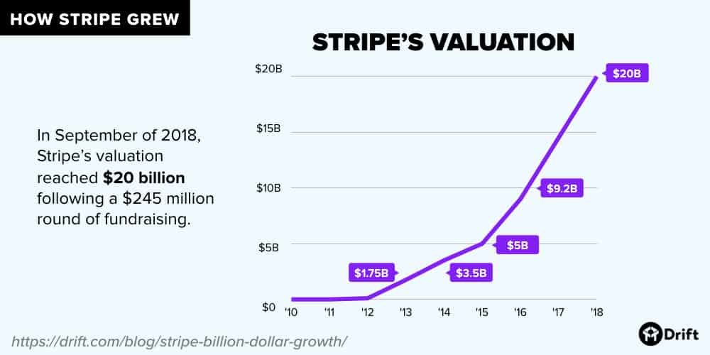
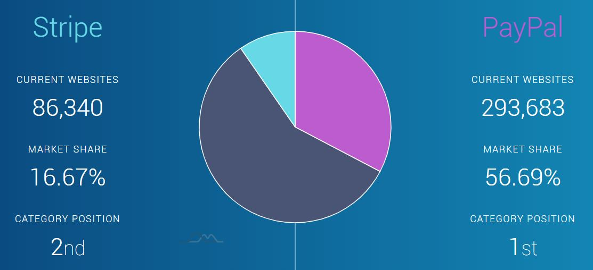
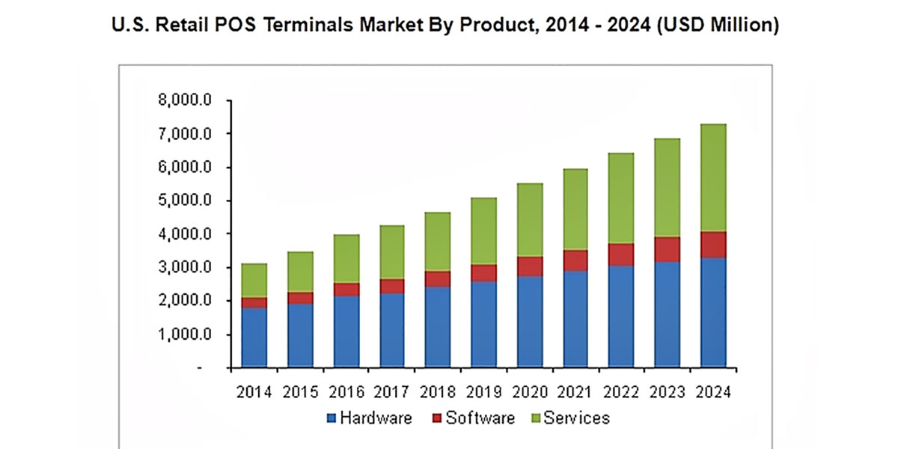

# FinTech Company Case Study

## Overview and Origin

**Name of company**\
Strip

**When was the company incorporated?**\
2010

**Who are the founders of the company?**\
John Collison and Patrick Collison

**How did the idea for the company (or project) come about?**\
Stripe was founded to allow individuals and businesses to make and receive payments over the Internet.

**How is the company funded? How much funding have they received?**\
Stripe has received 2 rounds of seed funding and 10 Series (A-G Extension) fundings totaling 1.6 billion USD.

## Business Activities:

**What specific financial problem is the company or project trying to solve?**\
The founders were "*really appalled by how hard it was to charge for things online.*"  Stripe has set out to provide a payment solution that's developer-centric delivered through a set of robust APIs, which is in stark contrast to the traditional payment gateways/processors business model.

**Who is the company's intended customer?  Is there any information about the market size of this set of customers? What solution does this company offer that their competitors do not or cannot offer? (What is the unfair advantage they utilize?)**\
Stripe's intended customers include eCommerce/retail, B2B platforms, SaaS companies with size ranging from startups to large tech firms.  It is one of the very first online payment processing companies that rely heavily on APIs and SDKs available in various languages.  It also offers transparent pricing and a slew of other products, including fraud-detection, recurring billing.  Like many tech startups, a big reason for its success could also be attributed to first-mover advantage.

**Which technologies are they currently using, and how are they implementing them? (This may take a little bit of sleuthing-- you may want to search the company's engineering blog or use sites like Stackshare to find this information.)**\
Stripe's core application is written in Ruby on Rails.  It also offers client libraries in the following languages.\

## Landscape:

**What domain of the financial industry is the company in?**\
Stripe is in the payments/billing domain while slowly moving into others like business lending via Atlas, personal/online banking via Monzo and Step.

**What have been the major trends and innovations of this domain over the last 5-10 years?**\
Since the emergence of Stripe, a number of other companies armed with robust APIs have also appeared, rendering traditional (payment gateway) and alternative (PayPal) payment processors less and less popular.

**What are the other major companies in this domain?**\
Adyen, a dutch company with a much more international presence has also been making headways in the online payments domain.

## Results

**What has been the business impact of this company so far?**\
Stripe has led the way for the popularization of payment APIs, allowing companies to minimize unnecessary development resources to integrate with external payment processors.

**What are some of the core metrics that companies in this domain use to measure success?How is your company performing, based on these metrics?**\
For any startup, valuation and online market share are 2 of the most critical success-measuring metrics.  In Stripe's case, it was valued at $35 billion in Sept 2019.\
\
Stripe's current online market share is at an all-time high at 16.67%, second only to PayPal's 56.69%.\

**How is your company performing relative to competitors in the same domain?**\
Stripe has performed extremely well and has been eating into PayPal's market shares in the last few years.

## Recommendations

**If you were to advise the company, what products or services would you suggest they offer? (This could be something that a competitor offers, or use your imagination!)**\
While Stripe has been growing as an extreme pace through its developer-centric approach, they've missed out on the small-business market due to the lack of a competitive mobile POS solution.  Square on the other hand has the lion's share of this segment thanks to its free credit card reader.

**Why do you think that offering this product or service would benefit the company?**\
In addition to capturing the small business segment, a mobile POS system would also allow Stripe to offer a low-cost in-person payment system.  Research studies have estimated the retail POS terminals market to grow to $8 billion and software only makes up a small percentage of this market.

**What technologies would this additional product or service utilize?**\
This requires Stripe to work with a hardware manufacturer to develop a mobile contactless reader and update its existing mobile app to add a payment capturing feature.

**Why are these technologies appropriate for your solution?**\
Contact-less/mobile payment is the future of retail commerce.  Tech conglomerates like Apple, Samsung and Google has invested very heavily in capturing this market.  Offering a tight integration with these platforms allow it to continue its growth.