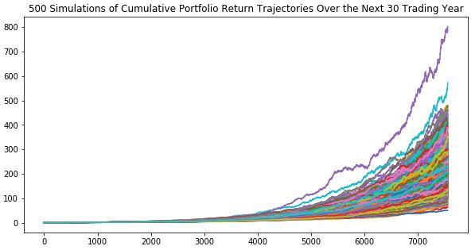

# Financial Report

---

#### Budget Analysis:

Last Year's Income Before Tax is **$7285**.

Current Monthly Income is **$500**.

Projected Year's Income Before Tax is **$7389**.

---

#### Retirement Planning:

The expected cumulative returns at 30 years for the **10th**, **50th**, and **90th** percentiles are **320.04%**, **198.76%** and **118.82%** respectively.

With an initial investment of **$20000**, the expected portfolio return in dollars at the **10th**, **50th** and **90th** percentiles are **$6400740.0**, **$3975214.17** and **$2376468.7** respectively.

The retirement income with **4%** withdraw rate at the 10th percentile, **$256029.6** exceeds the current projected income at **$6085**.

With the added **50%** investment, the retirement income **$384044.4** exceeds the current projected income at **$6085**.