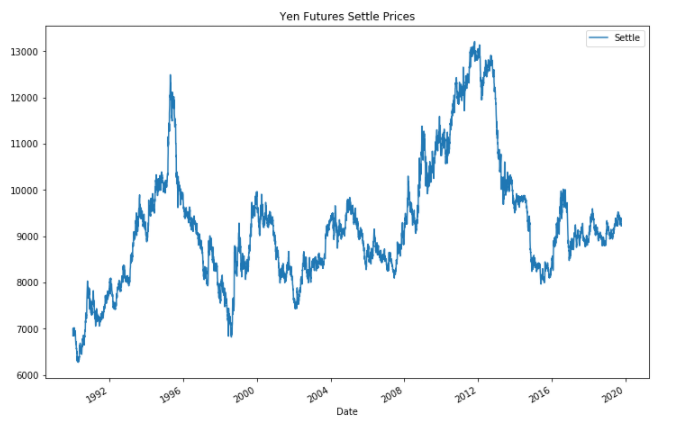
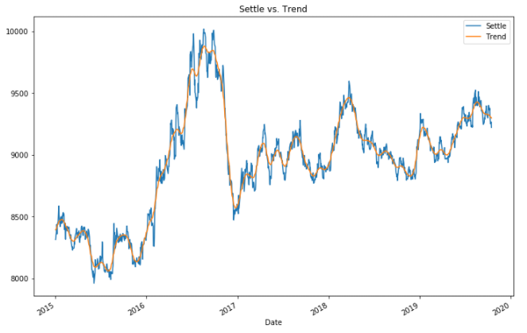
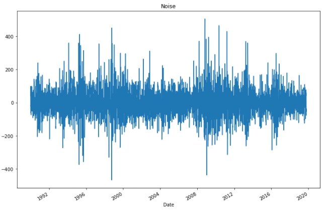
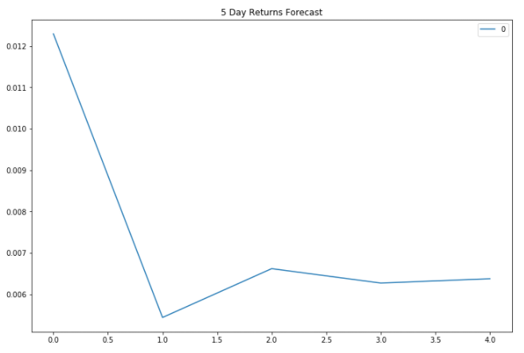
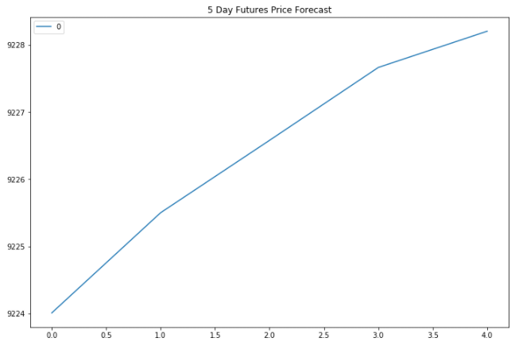
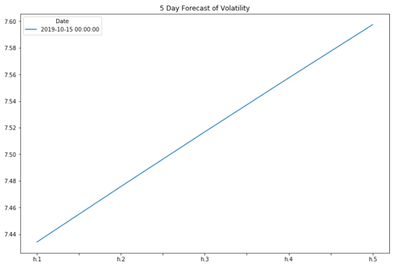
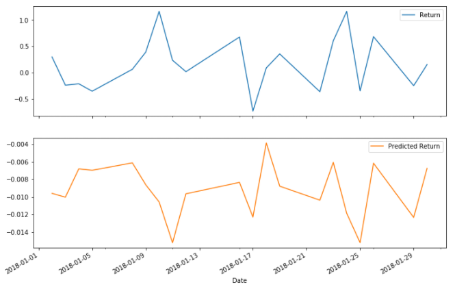

## Yen Futures Evaluation
### Time Series Analysis
* Data is Provided via CSV ([yen.csv](./yen.csv)).
* Data is truncated to post-1990 only.\

* Adding trend acquired through a Hodrick-Prescott Filter\

* And noise\

* ARMA forecasting\

* ARIMA forecasting\

* GARCH volatility forecasting\

#### Based on the analysis, this is my evaluation of Yen futures:
1. Since both ARMA and ARIMA forecasts shows an unafavorable outlook, yen might not be a good buy now.
2. With the yen's reputation as a traditional safe-haven investment, the evaluation above contradicts this belief therefore should be taken with a grain of salt. :sweat_smile:

### Regression Analysis
* Analysis performed on the same dataset and subset.
* Split data into training (pre-2018) and testing (post-2018) datasets
* Using sklearn's *Linear Regression* model to make predictions\

