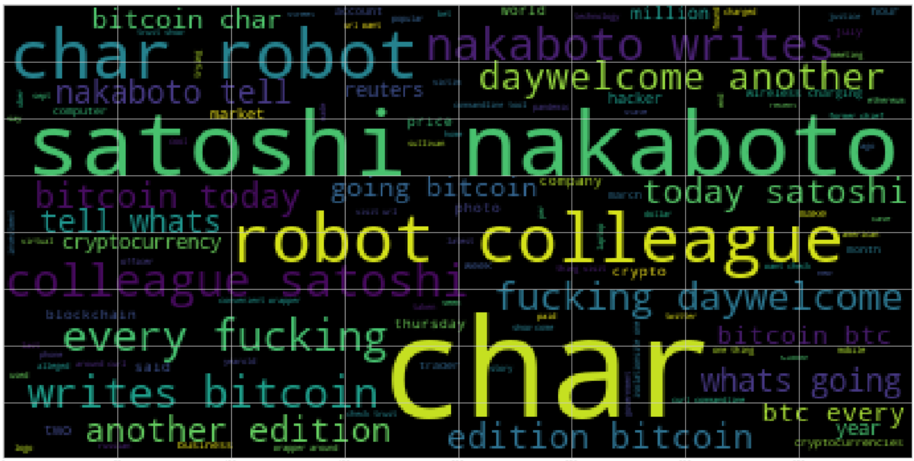
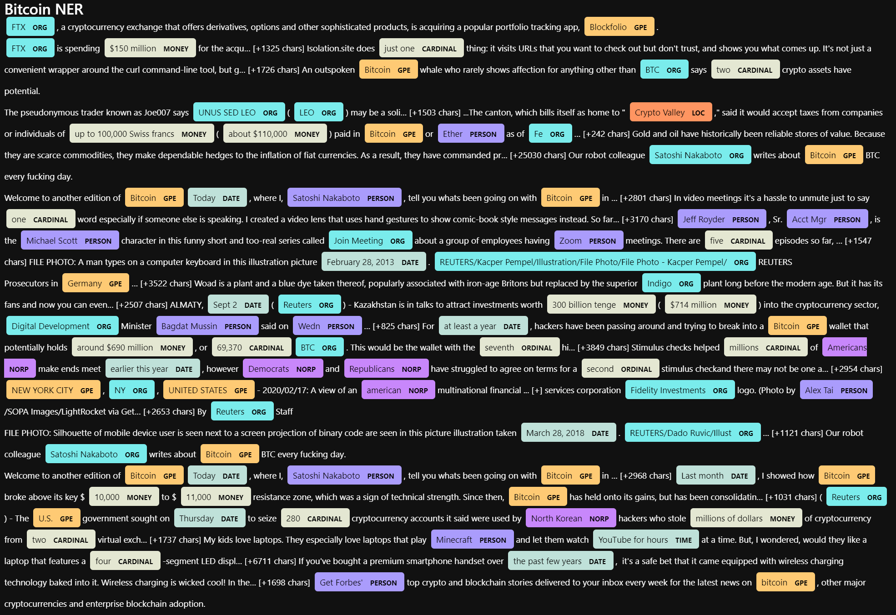
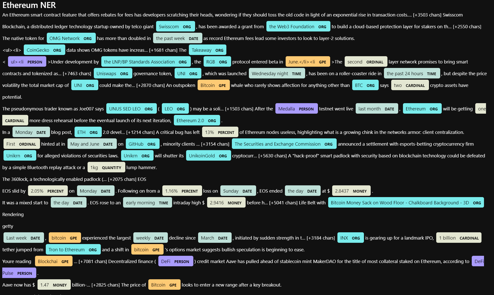

## 12 NLP homework summary
---
### Sentiment Analysis
* Questions:
    1.  Q: Which coin had the highest mean positive score?
        A: **Bitcoin** @ **0.07936666666666664**
    2.  Q: Which coin had the highest compound score?
        A: **Bitcoin** @ **0.15802666666666662**
    3.  Q. Which coin had the highest positive score?
        A: **Bitcoin** @ **0.326**
---
### Wordcloud
#### Bitcoin

#### Ethereum

---
### NER
#### Bitcoin

#### Ethereum
