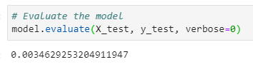
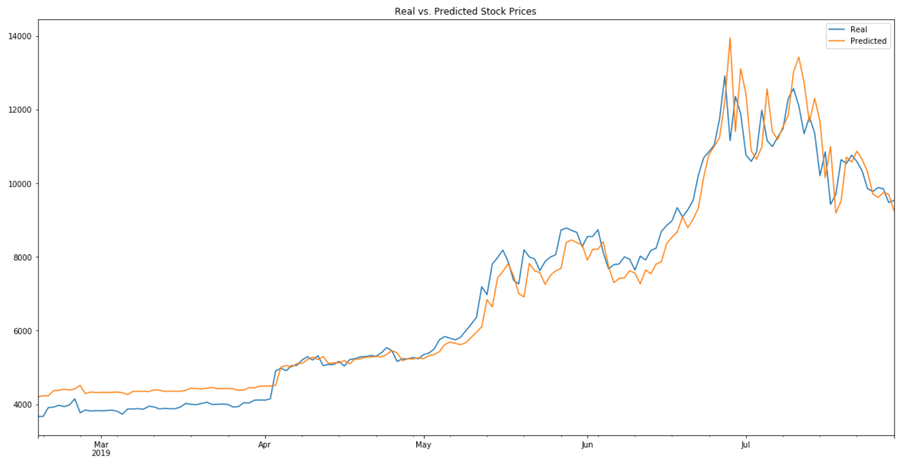

## 14 Deep Learning summary
---
### Crypto LSTM RNNs: Closing Price vs FNG (Fear and Greed Index)
* Questions:
    1.  Q: Which model has a lower loss?
        A: **Closing Price** in the thousandths vs FNG in the hundredths\
            window_size = 1\
             
    2.  Q: Which model tracks the actual values better over time?
        A: **Closing Price** with window_size = 1
            
    3.  Q. Which window size works best for the model??
        A: **Closing Price** with window_size = 1 and batch_size = 10
---