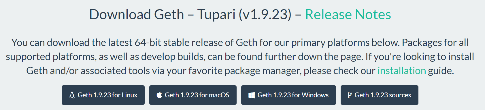
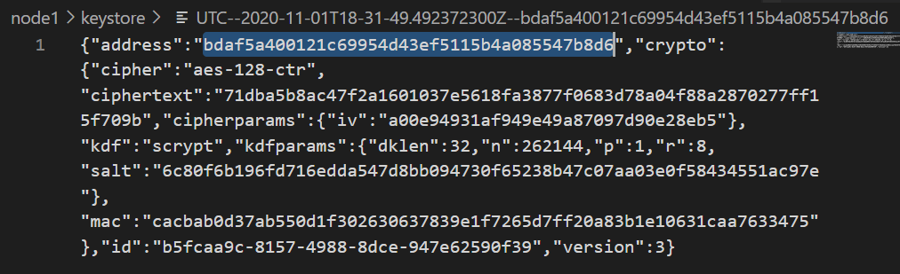
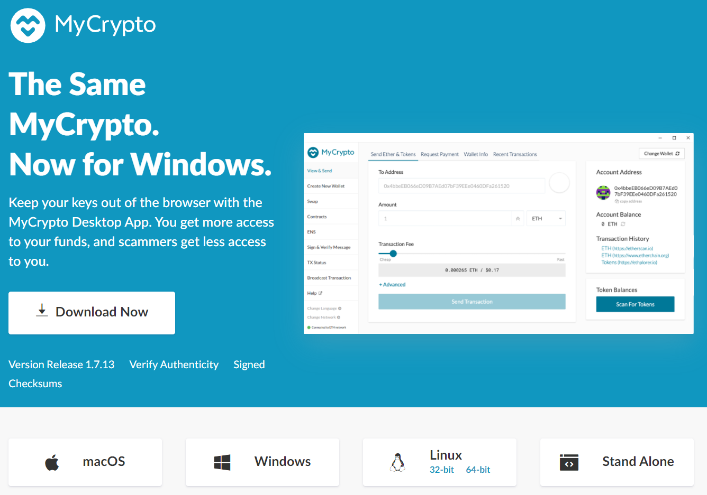

## 18 - Private Blockchain Network

#### Instructions for joining this network:
1. **geth**: Obtain from [Ethereum.org](https://geth.ethereum.org/downloads/). 
---

2. Network name: `network18`
    
---

3. To initialize the network, you'll need to run the following the command with the included [network18.json](./network18.json).
    ```bash
    ./geth init network18.json --datadir {YOUR NODE NAME}
    ```
---

4. To launch this as a full node:
 * First, you'll need to obtain the address of the new node, open the keystore file in VScode:
    ```bash
    code {YOUR NODE NAME}/keystore/{UTC FILE NAME}
    ```
 * Copy address key value in the json
    
 * Run the following command to join the network with *Remote Procedure Calls* `--rpc` (allows the network to work across multiple computers) and start *mining* `--mine` while *allowing HTTP external unlock* `--allow-insecure-unlock`:
    ```bash
    ./geth --datadir {YOUR NODE NAME} --unlock "{ADDRESS}" --mine --rpc --allow-insecure-unlock
    ```
    Enter password `727` then `enter` when prompted.
---

5. Once mining starts you can send transactions and access wallet info via **MyCrypto**:
 * Download and install via [mycrypto.com](https://download.mycrypto.com/)
 
 * Once installed, change network => Add Custom Node => Set Up Your Custom Node with the following information:
    * Network = `Custom`
    * Network Name = `network18`
    * Currency = `ETH`
    * Chain ID = `30290`
    * URL = `http://127.0.0.1:8545/` ***http** is used instead of **https***
 
 * Once connected, access wallet via Keystore File => Select Wallet File (UTC file) => Enter password `727`
 
 * You should now be able to an account balance if your node has started mining.  You can now send a transaction to one of the existing nodes:
    ```bash
    0xbdAf5A400121C69954d43EF5115B4A085547b8d6
    0x3541A93d2D5b589a6Afb5541155FC15C91FA2268
    ```
    
 * Once submitted you should be able to check transaction status:


 
 