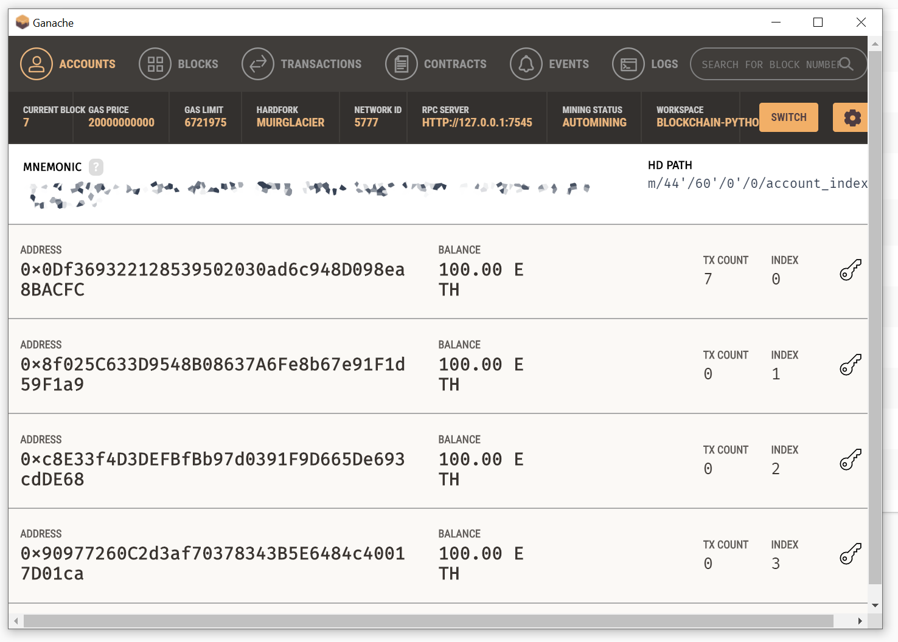
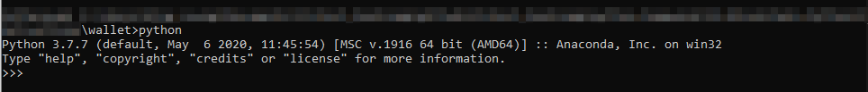

## 19 - Blockchain - Python
---
#### Sending blockchain transactions using python code only

1. Instead of using **MyCrypto** to generate wallet keystore file, I'm using **Ganache** to connect to my private ETH blockchain through the pre-generated mnemonic phrase.\
    * url: http://127.0.0.1:7545
    * network ID: 5777
    * coin: ETH
    
---

2. The [wallet.py](wallet.py) file supports the following coins:
    | Coin | Symbol | Global Variable |
    | --- | --- | --- |
    | Ethereum | `eth` | `ETH` |
    | Bitcoin Testnet | `btc-test` | `BTCTEST` |
---

3. To send a transaction, fire up an Anaconda prompt and navigate to wallet folder.\
    `python` + <kbd>enter</kbd>\
    
    `from wallet import *` + <kbd>enter</kbd>\
    
    At this point you can send transaction using the following command\
    `send_tx({coin} , {from address private key}, {to address}, {amount})` + <kbd>enter</kbd>\
    **Samples**:\
        *Ethereum*\
        amount = number of gwei\
        \
        Using the returned transaction hash we can check the transaction status in MyCrypto\
        
        *Bitcoin Testnet*
        amount = tBTC
        
        
---
4. Requirements:
To obtain `hd-wallet-derive` enter the following commands in git-bash
    ```bash
    git clone https://github.com/dan-da/hd-wallet-derive
    cd hd-wallet-derive
    php -r "readfile('https://getcomposer.org/installer');" | php
    php -d pcre.jit=0 composer.phar install
    ```

    Use `pypl` to install python library `bit` and `web3` are installed thru:
    ```shell
    pip install bit
    pip install web3
    ```

    Details can be found in [requirements.txt](requirements.txt).


