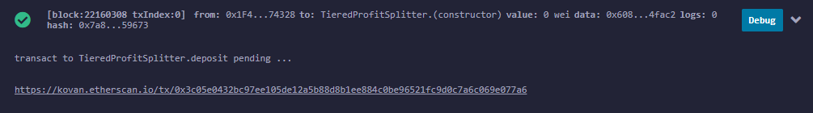

## 20 - Solidity

#### All of the following contracts have been deployed on the Kovan Testnet
---

1. First switch to the [Kovan Testnet](https://kovan-testnet.github.io/website/) on MetaMask.\
My public address is `0x1F4F1CDf9d050d7f8052d631399a28d605274328`.
    

---

2. All of the smart contracts are deployed thru **Ethereum Remix IDE**.

* First head on to [Remix](http://remix.ethereum.org/) and load the smart contracts written in solidity...
    

* while ensuring the compiler versions are compatible.
    

* Assuming no compiling error, contract should be deployed.\
    I used the following 3 test addresses:
    ```
    0x1f4f1cdf9d050d7f8052d631399a28d605274328
    0x379f025b37e04d9d5ec4e3198b36717fa54c513c
    0x469b346772b0aca572f4092069722f34ebc4fac2
    ```

---

3. To execute transaction within a contract it needs to be expanded to expose the internal functions.

    a. `AssociateProfitSplitter.sol`
        

    b. `TieredProfitSplitter.sol`
        

    c. `DeferredEquityPlan.sol`
        

---

4. Successful transactions:

    a. `AssociateProfitSplitter.sol` `deposit` [View on Etherscan](https://kovan.etherscan.io/tx/0xc66163905db99465a829c4230eb680b878f56bba6028e604e12818f127d6ddb1)
        
        

    b. `TieredProfitSplitter.sol` `deposit` [View on Etherscan](https://kovan.etherscan.io/tx/0x3c05e0432bc97ee105de12a5b88d8b1ee884c0be96521fc9d0c7a6c069e077a6)
        
        


